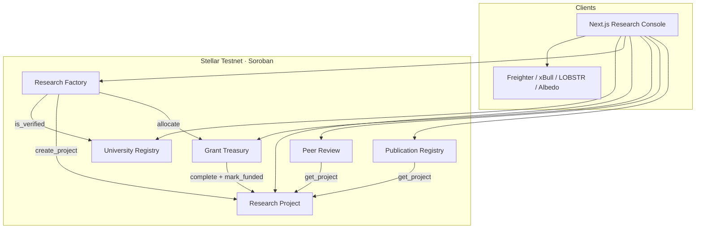
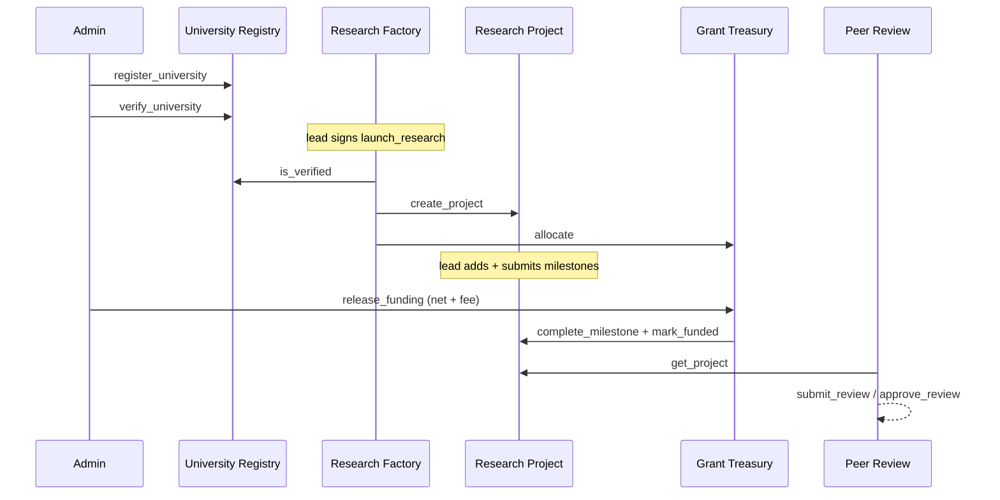
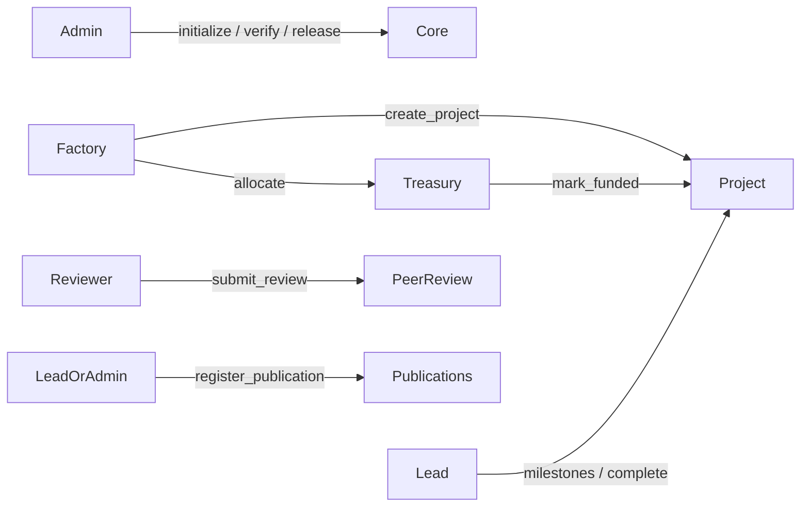

# ResearchHub

**Decentralized research grant & collaboration lifecycle on Stellar Soroban.**

ResearchHub is institutional research governance — not crowdfunding, not a document vault, not an education portal. Universities, funders, labs, reviewers, and students coordinate verified institutions, factory-launched projects, milestone releases, peer review, publications, and protocol-fee treasury accounting with an immutable event trail.

Built for the **Stellar Build Challenge — Orange Belt**. Designed to extend cleanly into a Green Belt production MVP.

---

## Why ResearchHub stands out (vs typical Orange Belt dApps)

| Capability | ResearchHub |
|---|---|
| Contract surface | **Six** single-responsibility Soroban contracts |
| Factory orchestration | Verify university → create project → **allocate treasury** in one call |
| Protocol fees | Fee BPS + recipient on milestone release (`fee`/`col` events) |
| Console honesty | **Empty-by-default** — no fake seed balances or invented charts |
| Wallet UX | Wallet picker every connect (**Freighter / xBull / LOBSTR / Albedo** real connectors) |
| Signing | Simulate → assemble → wallet-sign → submit for register / verify / launch / milestones / release / review |
| Transparency | Public fee + treasury + explorer-linked IDs page |
| Auth boundaries | Factory-only allocate · treasury-only fund marks · admin verify |

Compared with peers such as [ImpactChain](https://github.com/Nikkunj-145/ImpactChain/) (excellent grant/CSR Orange Belt work), ResearchHub adds **research-native peer review + publication registry**, deeper factory→treasury allocation, and an empty-ledger console policy.

---

## Live demo & submission

| | Link |
|---|---|
| **Live app (Vercel)** | <https://research-hub-stellar.vercel.app/> |
| **Demo video** | _Record with [`docs/DEMO_VIDEO.md`](./docs/DEMO_VIDEO.md)_ |
| **GitHub** | _Push this repo under your account_ |
| **Deploy / sample tx** | See [`deployments/testnet.json`](./deployments/testnet.json) |
| **University Registry** | [`CBHNV4VX…`](https://stellar.expert/explorer/testnet/contract/CBHNV4VXXFPJMRN2HLKR3LZ2J3DAE23NK7CPL23GYBA7HKRCO5O5DWLQ) |
| **Research Factory** | [`CC5DXDWP…`](https://stellar.expert/explorer/testnet/contract/CC5DXDWPMJLYS6TEBO4CEV4VWFRD3DBQ3AYVGH3ZRUQVFPFHGQNCVGVJ) |
| **Research Project** | [`CATLDEZI…`](https://stellar.expert/explorer/testnet/contract/CATLDEZIGMPJUX4LV3TWESFLO2EPGUZ6D3I3FNMMV7CBJ7GJYTSK4LBP) |
| **Grant Treasury** | [`CDAQ3SMG…`](https://stellar.expert/explorer/testnet/contract/CDAQ3SMGVUO4WACRSYCRXHJ36RXUMSAPNJYOA74LPK23NA7JBMDR3VM4) |
| **Peer Review** | [`CDGMFA7I…`](https://stellar.expert/explorer/testnet/contract/CDGMFA7IASZCFNHTRKUU7U4FVLYGEXVOLAM4K7MX5GAJBBDVESPYPNVX) |
| **Publication Registry** | [`CB4SF43J…`](https://stellar.expert/explorer/testnet/contract/CB4SF43JBSUND2SEMEG4GP2MA6SRXGR7RFHM4P5URQFMCBSAVJDIZJNW) |
| **Sample Tx** | [`718ed421…`](https://stellar.expert/explorer/testnet/tx/718ed421203fc9e13910271d3d9aa068cb18b93c493460a7c766962abc997979) |

> Live IDs also live in [`deployments/testnet.json`](./deployments/testnet.json) and `frontend/public/contracts.json`.

---

## System architecture



### Research lifecycle



### Authorization model



---

## Smart contracts

| Contract | Role |
|---|---|
| `university_registry` | Register / verify institutions |
| `research_factory` | Gate launches + create project + allocate treasury |
| `research_project` | Project + milestone lifecycle |
| `grant_treasury` | Allocate, release, collect protocol fees |
| `peer_review` | Scored reviews tied to projects |
| `publication_registry` | DOI-linked publications |
| `interfaces` | Shared types & errors |

### Events

`univ/reg` · `univ/verify` · `res/launch` · `grant/ok` · `ms/*` · `rev/sub` · `rev/ok` · `pub/reg` · `fund/rel` · `fee/col` · `res/done` · `act/upd`

---

## Repository layout

```
ResearchHub/
├── contracts/                 # 6 Soroban crates + interfaces + tests
├── frontend/                  # Next.js 15 · TypeScript · Tailwind
├── scripts/deploy.mjs         # Build → deploy → initialize → sample txs
├── deployments/testnet.json   # Live addresses + sample tx hash
├── docs/                      # Architecture, testing, checklist, Vercel, demo
├── .github/workflows/ci.yml
├── Makefile
└── README.md
```

---

## Quick start

### Prerequisites

- Rust stable + `wasm32v1-none`
- [Stellar CLI](https://developers.stellar.org/docs/tools/cli) v25+
- Node.js 20+
- [Freighter](https://www.freighter.app/)

### One-liners

```bash
make test          # contracts + frontend
make frontend-dev  # http://localhost:3000
make deploy        # testnet (funded `deployer` key)
```

### Frontend

```bash
cd frontend
npm install
npm run dev
```

Open http://localhost:3000 (or the port Next assigns).

---

## Frontend quality bar

Pages: Landing · Dashboard · Projects · Universities · Peer Reviews · Grants · Analytics · Activity · **Transparency** · Profile · **Settings**

- Wallet choice modal on every connect (Freighter / xBull / LOBSTR / Albedo)
- Network status banner with linked factory ID + wrong-network warning
- Skeletons, empty states, confirm dialogs, toasts
- Search / filters / pagination
- Charts stay empty until RPC returns projects
- Full signed flows: university register/verify, factory launch, milestones, treasury release, peer review
- Production invoke path: simulate → assemble → sign → submit

---

## Testing

```bash
# 40 smart-contract tests (auth, edge cases, fees, factory allocate, regression)
cargo test --workspace

cd frontend
npm run lint
npm run typecheck
npm run test
npm run build
```

---

## Orange Belt checklist

Mapped requirement → implementation: [`docs/ORANGE_BELT_CHECKLIST.md`](./docs/ORANGE_BELT_CHECKLIST.md)

---

## Docs

- [`docs/ARCHITECTURE.md`](./docs/ARCHITECTURE.md)
- [`docs/TESTING.md`](./docs/TESTING.md)
- [`docs/VERCEL_DEPLOY.md`](./docs/VERCEL_DEPLOY.md)
- [`docs/DEMO_VIDEO.md`](./docs/DEMO_VIDEO.md)
- [`docs/SUBMISSION.md`](./docs/SUBMISSION.md)
- [`CONTRIBUTING.md`](./CONTRIBUTING.md)

---

## Security notes

- Admin-only initialize / university verify / fee policy / funding release
- Factory-only project creation and treasury `allocate`
- Treasury-only `mark_milestone_funded`
- Peer review / publication gated on existing projects
- Fee BPS capped at 10%
- Verified-university gate before launch

---

## License

MIT © Manoj Aggarwal
